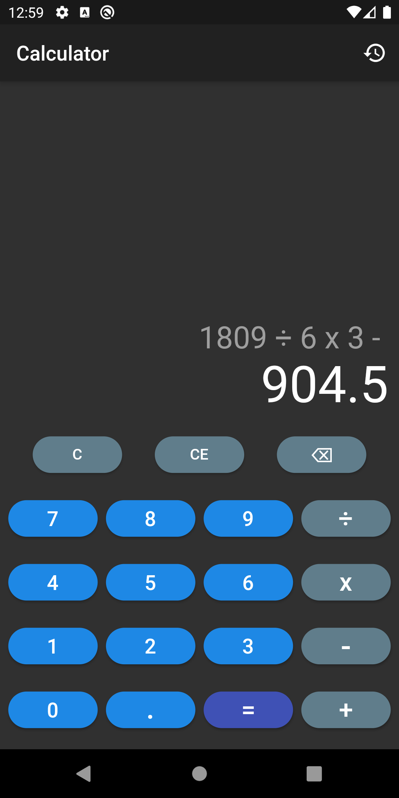
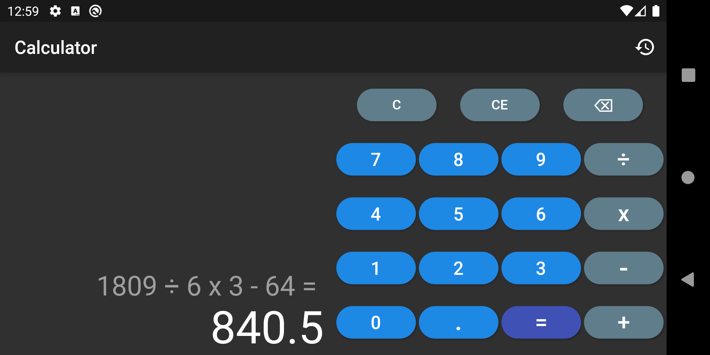
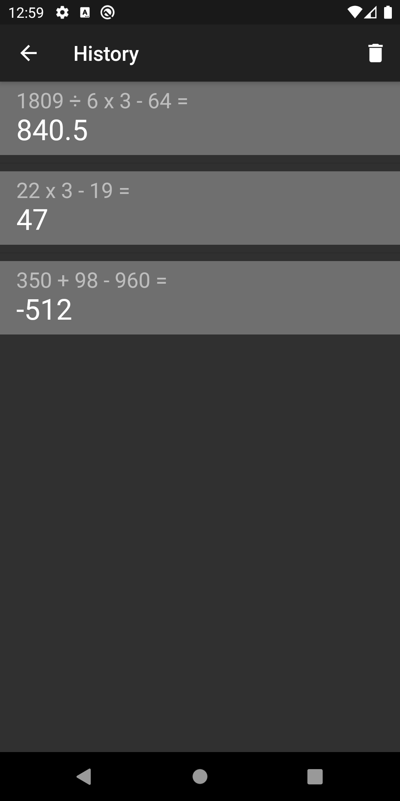

# Calculator

Calculator is written in Flutter for both Android and iOS.

Calculator implementation that uses provider to keep track of state. 
Portrait and landscape layout are supported.

Past calculations are stored and can be accessed by navigating to history view from the main view.
It is possible to erase the history as well.

Supported operations:
 - Clear ( C )
 - Clear Entry ( CE )
 - Backspace ( <- )
 - Addition ( + )
 - Subtraction ( - )
 - Multiplication ( * )
 - Division ( / )
 - Calculation ( = )

Portrait unfinished calculation |
------------ |
 |

Landscape finished calculation |
------------ |
 |

History view |
------------ |
 |
